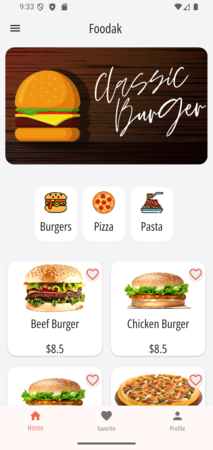
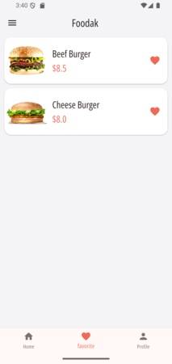
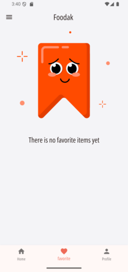
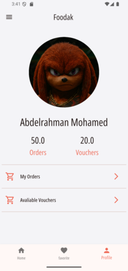
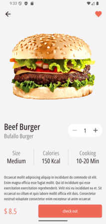
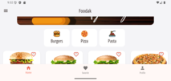
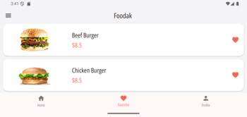
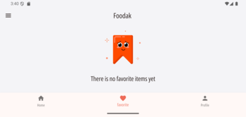
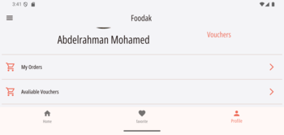
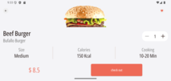

# Foodak - A Responsive Food Delivery App

Foodak is a sample food delivery application built with Flutter. The primary goal of this project is to demonstrate and practice building responsive and adaptive user interfaces that work seamlessly across a variety of screen sizes and device orientations.

## 🎯 Core Focus: Responsive & Adaptive Design

This application serves as a hands-on exercise for mastering responsive UI techniques in Flutter. The layout dynamically adjusts to provide an optimal user experience on both small and large screens, as well as in portrait and landscape modes.

Key techniques and widgets used to achieve this include:

- **`MediaQuery`**: Utilized extensively to get information about the current device's screen size (`MediaQuery.of(context).size`) and orientation (`MediaQuery.of(context).orientation`). This allows for conditional rendering of different layouts based on the available space and whether the device is in portrait or landscape mode.

- **`LayoutBuilder`**: Implemented within widgets like `GridItem` to build UI components that respond to the constraints provided by their parent widget. This is crucial for creating truly modular and reusable responsive components.

- **Conditional Layouts**: The code contains `if/else` blocks and collection `if`s (`if (isLandScape) ...`) to render entirely different widget trees for portrait vs. landscape orientations, ensuring the UI is always intuitive and usable.

- **Flexible & Constrained Sizing**: Widgets are sized using fractions of the screen width/height and constraints from `LayoutBuilder`, rather than hardcoded pixel values. This ensures that the UI scales gracefully on any device.

## ✨ Features

- **Home Screen**: Displays a promotional banner and a grid of food items. The grid's column count and item aspect ratio change based on screen size and orientation.
- **Category Filtering**: On the home screen, users can tap on a category to filter the displayed food items. Tapping the selected category again clears the filter.
- **Favorites Screen**: Shows a list of items the user has marked as a favorite. It includes an empty state for when no favorites are selected.
- **Item Details Screen**: Provides a detailed view of a food item, including a larger image, description, and properties like size and calories. The layout is fully responsive for both portrait and landscape modes.
- **Profile Screen**: A user profile page that dramatically changes its layout between portrait and landscape modes to better utilize screen real estate.
- **Adaptive UI**: The app adapts its layout for:
  - Small Screens (e.g., mobile phones)
  - Large Screens (e.g., tablets or web)
  - Portrait Orientation
  - Landscape Orientation

## 📸 Screenshots

The UI dynamically adapts to different screen sizes and orientations.

**Portrait Mode**

|                        Home Screen                        |                    Favorites Screen                     |                           Empty Favorites                           |                    Profile Screen                    |                              Item Details                               |
| :-------------------------------------------------------: | :-----------------------------------------------------: | :-----------------------------------------------------------------: | :--------------------------------------------------: | :---------------------------------------------------------------------: |
|  |  |  |  |  |

**Landscape Mode**

|                            Home Screen                             |                          Favorites Screen                          |                                Empty Favorites                                |                         Profile Screen                          |                               Item Details                                |
| :----------------------------------------------------------------: | :----------------------------------------------------------------: | :---------------------------------------------------------------------------: | :-------------------------------------------------------------: | :-----------------------------------------------------------------------: |
|  |  |  |  |  |

## 🛠️ Technologies Used

- **Flutter**: The UI toolkit for building natively compiled applications for mobile, web, and desktop from a single codebase.
- **Dart**: The programming language used for Flutter development.

## 📂 Project Structure

The project follows a feature-first architectural approach, where code is organized by features (services) to promote scalability and maintainability.

```
lib/
├── core/
│   └── theme/          # App-wide theme and color definitions
├── services/
│   ├── favorite/
│   │   └── presentation/
│   │       └── screens/  # Favorite screen UI
│   ├── home/
│   │   ├── data/
│   │   │   └── models/   # Data models for food items
│   │   └── presentation/
│   │       ├── screens/  # Home screen UI
│   │       └── widgets/  # Reusable widgets for the home feature
│   └── profile/
│       └── presentation/
│           └── screens/  # Profile screen UI
└── main.dart             # App entry point
```
